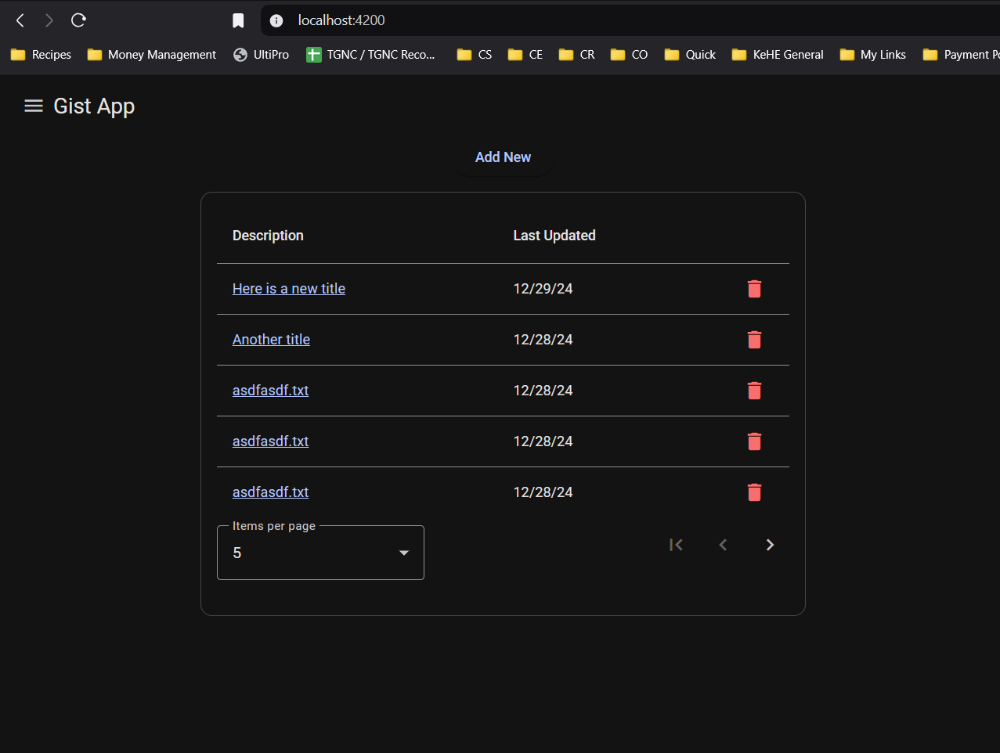
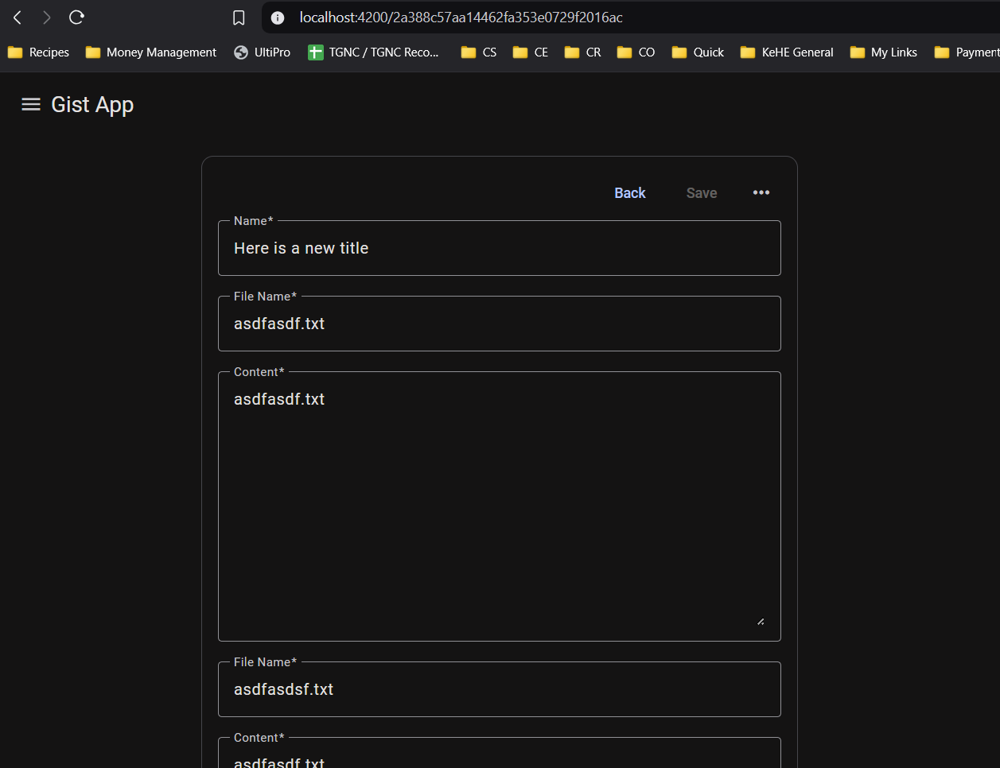

# Gist App

#### Deployed Link: [Explore Gist App](https://a-thread.github.io/gist-app/)

---

#### Table of Contents

* [Description](#description)
  + [Key Features](#key-features)
  + [Authentication](#authentication)
  + [Technologies Used](#technologies-used)
  + [Security](#security)
* [Contributing](#contributing)
* [Questions](#questions)
* [License](#license)

---

## Description

| home | detail |
|--|--|
|  |  |

**Gist App** simplifies the management of GitHub gists, providing users with a seamless way to create, edit, view, and delete their gists. Designed for productivity and ease of use, this application is powered by robust technologies on both frontend and backend to ensure smooth operation and security.

### Key Features

* **Gist Management**: Create, edit, delete, and organize GitHub gists effortlessly.
* **Real-Time Sync**: Seamlessly integrates with GitHub for real-time updates.
* **User-Friendly Interface**: Simple, responsive design for a smooth user experience.

---

### Authentication

Gist App uses **GitHub OAuth** for secure user authentication. The process includes:
* Redirecting users to GitHub's login page.
* Exchanging authorization codes for secure access tokens.
* Managing authenticated requests to GitHub's API securely.

---

### Technologies Used

#### Frontend

* **Framework**: [Angular](https://angular.io/) (v19.0.5)
* **Styling**: SCSS
* **Libraries**: 
  + [PrismJS](https://prismjs.com/) for syntax highlighting
  + [RxJS](https://rxjs.dev/) for reactive programming

#### Backend

* **Framework**: [Express.js](https://expressjs.com/)
* **Authentication**: GitHub OAuth
* **Libraries**:
  + [Axios](https://axios-http.com/) for HTTP requests
  + [dotenv](https://github.com/motdotla/dotenv) for secure environment variable management
  + [CORS](https://github.com/expressjs/cors) for cross-origin request handling

---

### Security

**Authentication**:
* OAuth 2.0 protocol ensures that user credentials are never exposed.

**Application**:
* Sensitive data like API keys and client secrets are managed through environment variables.
* Backend endpoints are safeguarded against common vulnerabilities (e.g., XSS, CSRF).

**Data**:

* No user data is shared with third parties, ensuring complete privacy.
* All data transmitted between the application and GitHub's API is encrypted using HTTPS to prevent interception.

---

### Contributing

If you'd like to contribute to this application, feel free to submit a pull request!

---

### Questions

If you have any questions, please [email me](mailto:a.threadless@proton.com).

Explore more of my work on [GitHub](https://github.com/a-thread).

---

### License

This project is licensed under the [MIT License](https://opensource.org/licenses/MIT).

*© 2024 Aiden Threadgoode*
